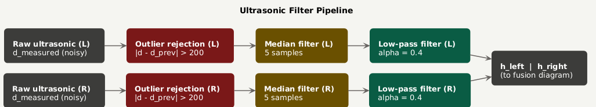
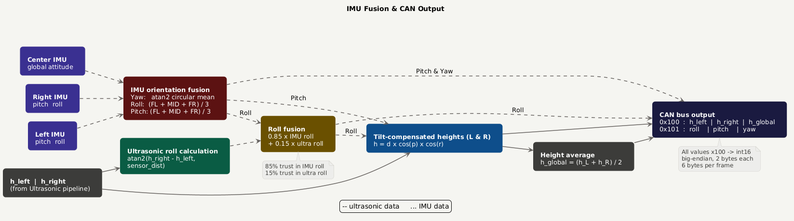

# 2026_S4_POC_ElectricHydrofoils

## Overview

This repository contains the software for the Solarboat Sensor Fusion System, developed for the Q Solarboat project. The software runs on an STM32L432KC microcontroller and is responsible for acquiring, filtering, fusing, and distributing sensor data from multiple IMUs and ultrasonic sensors.

The primary objective of the system is to provide reliable height and orientation measurements that can be used by higher-level control systems, such as foil angle control and ride-height regulation.

---

## System Architecture

The system combines data from:

* 3x IMU sensors
* 2x Ultrasonic distance sensors
* CAN bus communication
* Modbus RTU over UART

The software performs:

1. Sensor acquisition via Modbus RTU
2. Data filtering
3. IMU orientation fusion
4. Ultrasonic roll calculation
5. Roll fusion
6. Height correction
7. CAN transmission

The complete processing flow is documented in the included UML diagrams.

---

## Repository Structure

```text
├── Core/
│   ├── Src/
│   │   ├── main.c
│   │   ├── uart_comm.c
│   │   ├── imu.c
│   │   ├── ultrasonicFilters.c
│   │   ├── can_comm.c
│   │   └── modbus_crc.c
│   │
│   └── Inc/
│       ├── config.h
│       ├── main.h
│       ├── uart_comm.h
│       ├── imu.h
│       ├── ultrasonicFilters.h
│       ├── can_comm.h
│       └── modbus_crc.h
│
├── docs/
│   ├── UltraDiagram.puml
│   ├── IMUDiagram.puml
│   ├── ultrasonic_pipeline.png
│   └── imu_fusion_pipeline.png
│
└── README.md
```

---

## Sensor Data Processing

### Ultrasonic Filtering

Raw ultrasonic measurements are processed through a filter chain consisting of:

1. Outlier rejection
2. Median filter
3. Low-pass filter

This combination removes invalid measurements, suppresses spikes, and reduces high-frequency noise caused by vibrations, reflections, and wave disturbances.

### IMU Orientation Fusion

Three IMUs are used to improve measurement robustness.

* Roll and pitch are calculated using the average value of all IMUs.
* Yaw is calculated using a circular mean to avoid discontinuities around the 0°/360° boundary.

### Ultrasonic Roll Calculation

An independent roll estimate is calculated from the difference in measured heights between the left and right ultrasonic sensors.

This provides a geometric reference relative to the water surface.

### Roll Fusion

The IMU roll and ultrasonic roll are combined using a weighted fusion:

```text
Roll_fused = α · Roll_IMU + (1 - α) · Roll_ultra
```

Current configuration:

* IMU contribution: 85%
* Ultrasonic contribution: 15%

### Height Correction

After the final roll and pitch angles have been determined, tilt compensation is applied:

```text
h = d · cos(pitch) · cos(roll)
```

This converts the measured sensor distance into the actual vertical height above the water surface.

---

## Communication

### Modbus RTU

Sensor communication is performed using Modbus RTU over UART.

Supported devices:

| Device           | Address |
| ---------------- | ------- |
| Ultrasonic Left  | 0x01    |
| Ultrasonic Right | 0x02    |
| IMU Front Left   | 0x50    |
| IMU Main         | 0x51    |
| IMU Front Right  | 0x52    |

---

### CAN Bus

Two CAN messages are transmitted:

#### CAN ID 0x100

Contains:

* Left corrected height
* Right corrected height
* Global height

#### CAN ID 0x101

Contains:

* Roll
* Pitch
* Yaw

All values are transmitted as scaled int16 values. 
To recover the original floating-point value, the received data must be divided by **100**.

---

## Configuration

System parameters can be adjusted in `config.h`.

Important settings include:

```c
#define SENSOR_DISTANCE_MM      150
#define MEDIAN_SIZE             5
#define OUTLIERTHRESHOLD        200.0f
#define LOWPASSALPHA            0.4f
#define FUSE_ALPHA              0.85f
```

---

## UML Diagrams

## Ultrasonic Processing Flow



## IMU Fusion and CAN Output Flow



---


## Authors

Made by Jochem Wansink and Myrdinn van Hallem.

Developed as part of a project to convert the Solarboat foilcontrol to electrical foilcontrol.
